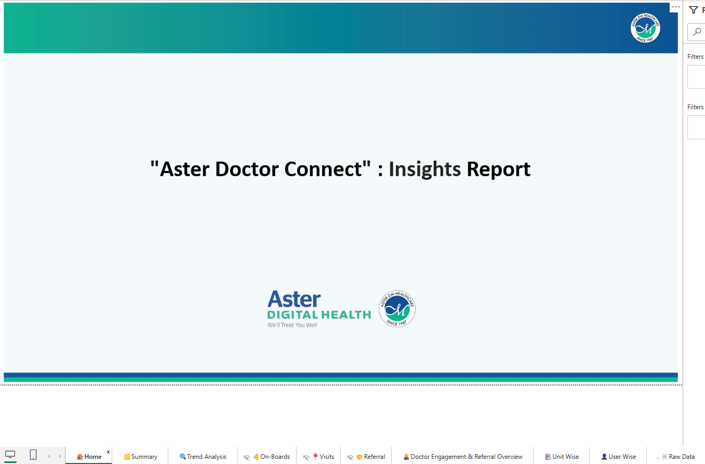
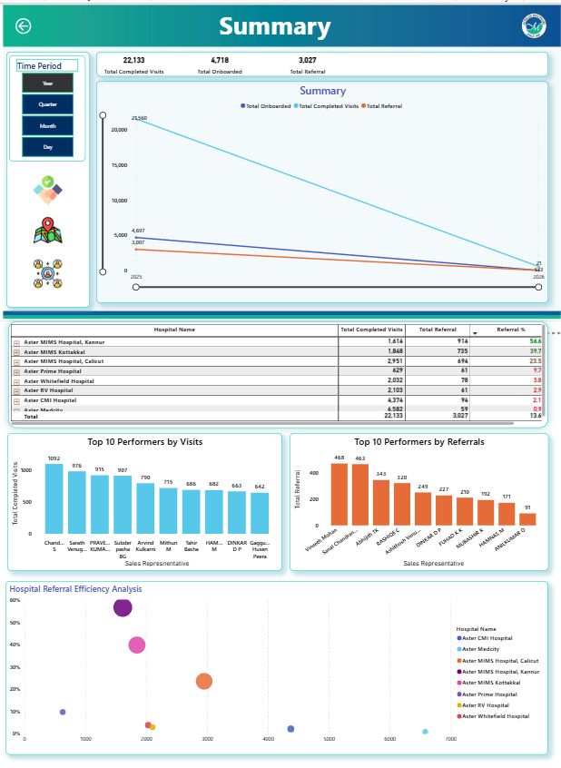
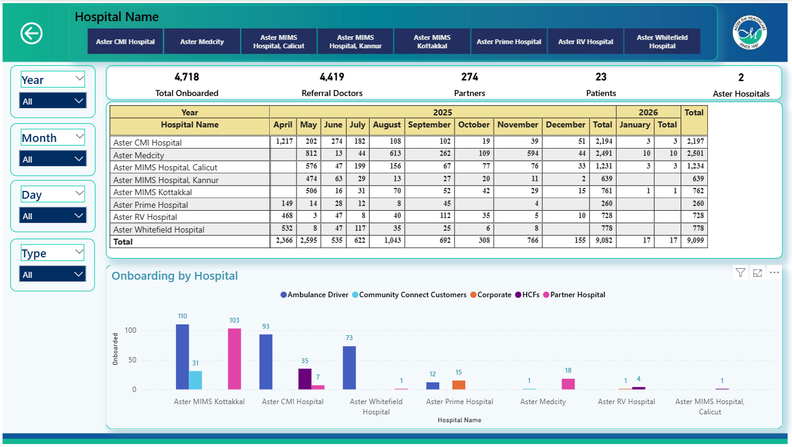
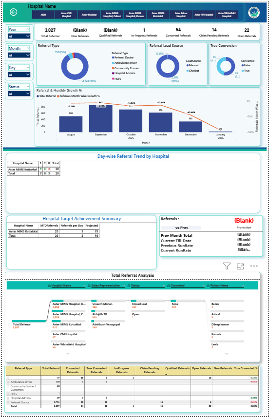
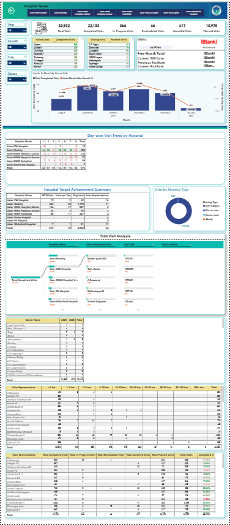
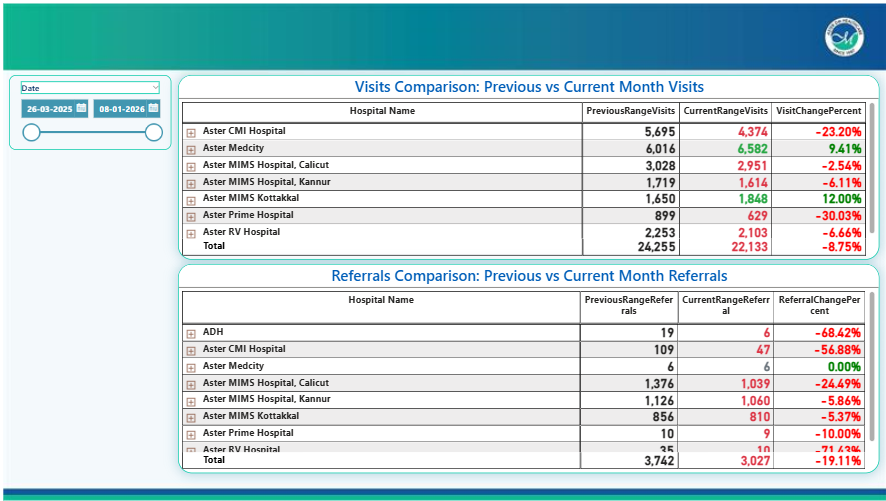
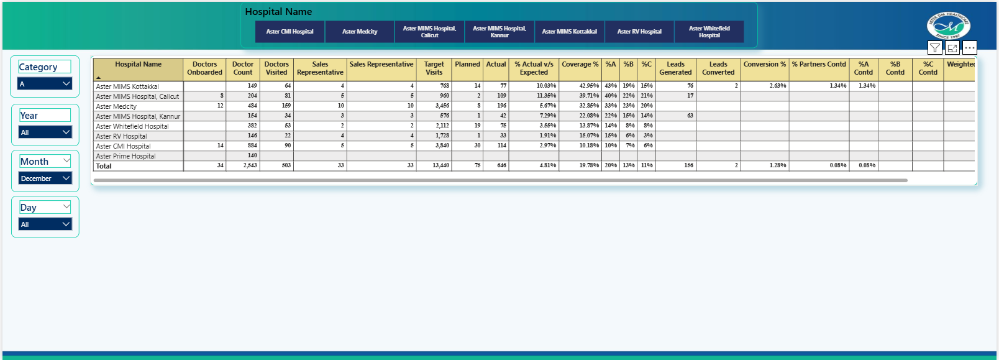
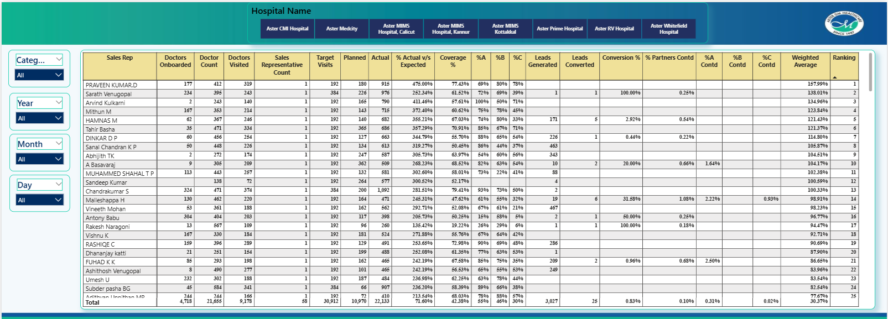

# Aster Doctor Connect – Analytics Dashboard

## Project Overview

This project showcases a **Power BI analytics dashboard developed during my internship** to analyze the operational performance of the **Aster Doctor Connect program**.

The Aster Doctor Connect initiative connects external doctors with Aster hospitals through field engagement by sales representatives.

### Program Workflow

1. Sales representatives visit doctors in different locations.
2. Doctors are introduced to Aster hospitals and services.
3. Doctors who join the network can refer patients to Aster hospitals.
4. When a referred patient receives treatment:
   - The referring doctor earns commission.
   - Aster hospitals gain additional patient inflow and revenue.

Because this ecosystem involves **many doctors, hospitals, and sales representatives**, a centralized analytics dashboard was developed to monitor performance and generate insights.

The dashboard helps stakeholders:

- Track doctor onboarding
- Monitor field visit activity
- Analyze referral generation
- Evaluate hospital performance
- Measure sales representative effectiveness
- Identify opportunities to optimize operations

---

## Data Confidentiality Notice

Due to organizational confidentiality policies:

- The original dataset and Power BI file are **not included in this repository**.
- All screenshots included in this project contain **dummy or masked data**.
- The purpose of this repository is to demonstrate **dashboard design, analytics logic, and business insights**.

---

# Dashboard Structure

The dashboard contains several analytical pages:

1. Home Page
2. Summary Dashboard
3. Doctor Onboarding Analysis
4. Referral Analysis
5. Visits Analysis
6. Trend Analysis
7. Unit Wise Performance
8. User Wise Performance

Each page focuses on a different operational dimension of the Aster Doctor Connect program.

---

# 1. Home Page

The Home Page serves as the **entry point to the dashboard**.

### Key Features

- Dashboard title and branding
- Navigation to different analytical pages
- Overview introduction to the insights report

It provides users with a clear starting point for exploring the dashboard.

---

# 2. Summary Dashboard

The **Summary page provides a high-level overview of the program's performance**.

This page consolidates key metrics and visualizations that help stakeholders quickly understand overall trends in:

- Doctor onboarding
- Patient visits
- Referral activity

### Key Indicators

The dashboard highlights the overall activity of the program including:

- Visit performance
- Onboarding activity
- Referral generation

### Time Filters

Users can analyze performance across different time periods:

- Year
- Quarter
- Month
- Day

### Navigation Icons

The summary page includes quick navigation icons to access:

- Onboarding analysis
- Visits analysis
- Referral analysis

---

# 3. Doctor Onboarding Analysis

This page focuses on **tracking how doctors join the Aster Doctor Connect network**.

### Features

- Hospital level filtering
- Time based filters
- Doctor onboarding trends

### Key Visualizations

**Onboarding Table**

Shows how doctor onboarding is distributed across hospitals over time.

**Onboarding Distribution Chart**

Shows onboarding activity across different onboarding channels such as:

- Community connections
- Corporate networks
- Partner hospitals
- Other onboarding sources

This page helps stakeholders understand **how the doctor network is expanding**.

---

# 4. Referral Analysis

The **Referral Analysis page focuses on patient referrals generated through the doctor network**.

Referrals represent the conversion of doctor engagement into patient treatment opportunities.

### Key Metrics

The dashboard tracks different referral stages:

- Total referrals
- New referrals
- Qualified referrals
- Referrals in progress
- Converted referrals
- Claim pending referrals
- Open referrals

### Visualizations

**Referral Type Distribution**

Shows how referrals are generated through different channels such as:

- Referring doctors
- Ambulance drivers
- Community connections
- Hospital administrators
- Healthcare facilitators

**Lead Source Analysis**

Compares referral sources such as manual referrals and digital channels.

**Referral Conversion Chart**

Shows the proportion of referrals that successfully convert into treatments.

**Monthly Referral Growth**

Tracks referral generation trends and growth patterns over time.

**Hospital Referral Trends**

Shows how referrals vary across hospitals and time periods.

**Referral Flow Analysis**

Provides a hierarchical breakdown showing:

Hospital → Sales Representative → Referral Status → Conversion Outcome

This helps track the **referral lifecycle from generation to final outcome**.

---

# 5. Visits Analysis

The **Visits Analysis page focuses on sales representative engagement with doctors**.

Doctor visits are the primary way sales representatives build relationships with doctors and encourage referrals.

### Key Indicators

The page summarizes different stages of visit activity:

- Total visits scheduled
- Completed visits
- Visits in progress
- Rescheduled visits
- Cancelled visits
- Planned visits

### Key Visualizations

**Visited Areas Table**

Shows geographical areas where doctor visits occur most frequently.

**Planned Visit Areas**

Displays locations where upcoming visits are scheduled.

**Monthly Visit Growth Chart**

Tracks how doctor engagement changes over time.

**Day-wise Visit Trend**

Shows visit activity distribution across hospitals and days.

**Meeting Type Analysis**

Categorizes visits based on meeting formats such as:

- Independent meetings
- One-on-one discussions
- Cluster meetings

**Visit Flow Analysis**

Shows the relationship between:

Hospital → Sales Representative → Location → Doctor

This helps identify which representatives are actively engaging doctors.

---

# 6. Trend Analysis

The **Trend Analysis page compares performance between different time periods**.

The comparison is dynamic based on the selected date range.

### Example

If the user selects:

- Last month → compared with previous month
- Last 15 days → compared with previous 15 days

### Performance Comparison

Two tables compare performance across hospitals:

**Visit Performance Comparison**

Shows how doctor visits changed compared to the previous period.

**Referral Performance Comparison**

Shows how referral generation changed over time.

### Color Indicators

- **Green** → Performance improvement
- **Red** → Performance decline

This allows stakeholders to quickly identify performance changes.

---

# 7. Unit Wise Performance

The **Unit Wise Performance page evaluates hospital-level operational performance**.

Each hospital unit is analyzed across multiple performance dimensions.

### Metrics Covered

- Doctors onboarded
- Total doctors in network
- Doctors visited
- Sales representatives assigned
- Target visits
- Planned visits
- Actual visits completed
- Coverage percentage
- Leads generated
- Leads converted
- Conversion percentage

This page provides a **holistic view of how each hospital contributes to the program's performance**.

---

# 8. User Wise Performance

The **User Wise Performance page analyzes individual sales representative performance**.

This page consolidates all engagement and conversion metrics at the **salesperson level**.

### Metrics Evaluated

For each sales representative the dashboard tracks:

- Doctors onboarded
- Total doctors managed
- Doctors visited
- Assigned visit targets
- Planned visits
- Actual visits completed
- Visit coverage percentage
- Leads generated
- Leads converted
- Conversion performance
- Partner contribution categories
- Weighted performance score
- Overall ranking

### Purpose

This page helps management:

- Evaluate field team productivity
- Identify top performing representatives
- Detect underperforming regions
- Improve sales engagement strategies

By consolidating all operational metrics, this page provides a **complete performance overview of the field sales team**.

---

# Business Impact

This dashboard enables healthcare leadership to:

- Monitor doctor engagement
- Track referral pipeline performance
- Measure field sales productivity
- Compare hospital performance
- Identify operational inefficiencies
- Improve referral conversion strategies

The dashboard transforms raw operational data into **actionable insights that support data-driven decision making**.

---

# Tools & Technologies

- Power BI
- Data Modeling
- DAX
- Data Visualization
- Healthcare Analytics

---

# Author

**Skanda N Raj**

Computer Science Graduate  
Data Analyst | Data Engineering
