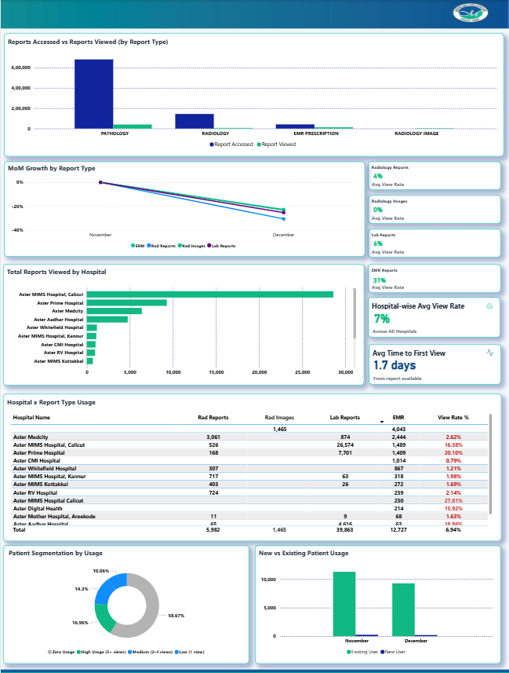
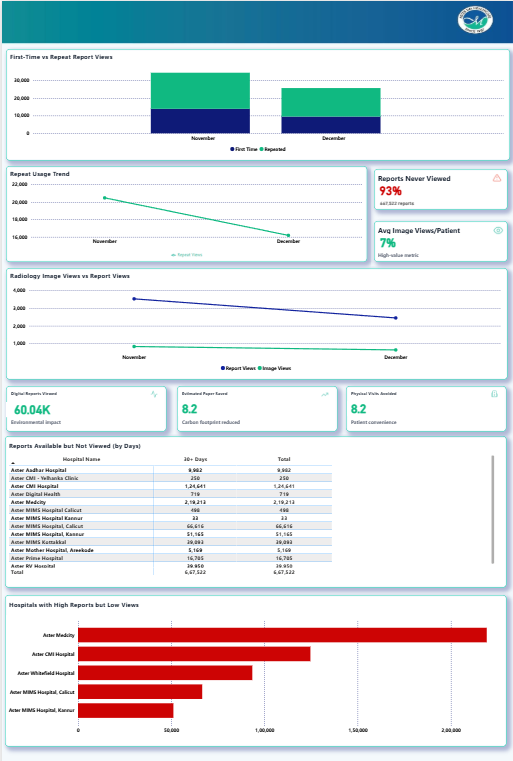
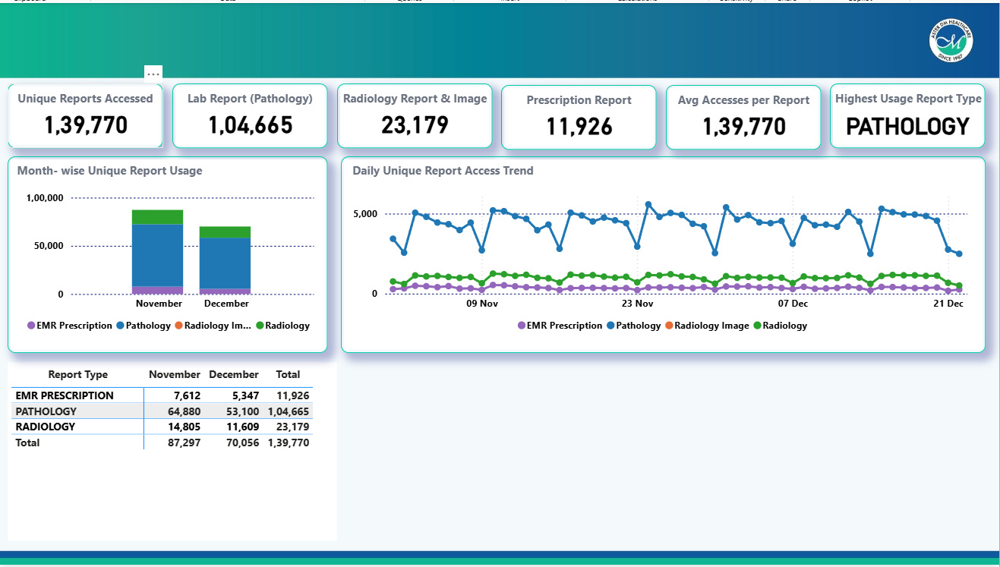

# 🏥 Health Records Usage Dashboard

## 📌 Project Overview

The **Health Records Usage Dashboard** is a Power BI analytics dashboard designed to analyze how patients interact with the **Health Records feature within a healthcare application**.

This feature allows patients to **digitally access and view their medical reports through the mobile application**. The dashboard helps healthcare teams and product managers understand how effectively patients are using this feature.

Through this dashboard, stakeholders can monitor:

- 👥 Patient adoption of digital health records
- 📄 Medical report access and viewing behavior
- 📈 Engagement trends over time
- 🏥 Hospital-level usage patterns
- 📊 Patient interaction with different report types

These insights help organizations **improve patient experience and optimize digital healthcare services**.

---

# 📊 Dashboard Pages

The dashboard consists of four analytical pages:

1️⃣ Executive Overview  
2️⃣ Report & Patient Analysis  
3️⃣ Engagement & Sustainability  
4️⃣ IBR Report (Individual Report Behavior)

---

# 1️⃣ Executive Overview

The **Executive Overview page** provides a high-level summary of how patients interact with the digital health records feature.

### Key Metrics

The dashboard highlights important indicators including:

- Total unique patients accessing health records
- Total reports accessed in the application
- Total reports viewed by patients
- Overall report view rate
- Average reports viewed per patient
- Platform activity through API usage
- Recent engagement trends

These metrics help stakeholders quickly understand **feature adoption and usage intensity**.

---

### 📈 Monthly Report Views Trend

A line chart visualizes the monthly trend of report views.  
This helps identify:

- Growth or decline in report usage
- Changes in patient engagement
- Monthly interaction patterns

---

### 🧾 Distribution by Report Type

A donut chart shows how report views are distributed across report categories such as:

- EMR prescriptions
- Pathology reports
- Radiology reports
- Radiology images

This helps identify **which report types are most frequently accessed by patients**.

---

# 2️⃣ Report & Patient Analysis

The **Report & Patient Analysis page** provides deeper insights into how patients interact with medical reports across hospitals.

---

### 📊 Reports Accessed vs Reports Viewed

A bar chart compares:

- Reports accessed
- Reports actually viewed

This helps measure **true engagement with available reports**.

---

### 📈 Month-over-Month Growth by Report Type

A trend chart shows how report engagement changes month over month across report categories.

This helps identify:

- Report categories gaining popularity
- Declining engagement patterns
- Opportunities to improve report accessibility

---

### 🏥 Total Reports Viewed by Hospital

A horizontal bar chart displays report viewing activity across hospitals.

This visualization helps identify:

- Hospitals with high digital adoption
- Facilities with lower patient engagement
- Locations generating the highest report interaction

---

### 👥 Patient Segmentation by Usage

A donut chart categorizes patients based on their engagement level:

- High usage
- Medium usage
- Low usage
- No report interaction

This helps understand **how actively patients use digital health records**.

---

### 🆕 New vs Existing Patient Usage

A comparison chart analyzes engagement between:

- New users
- Existing users

This helps determine whether the feature is **driving new adoption or primarily used by existing patients**.

---

# 3️⃣ Engagement & Sustainability

The **Engagement & Sustainability page** analyzes deeper engagement patterns and highlights the environmental benefits of digital healthcare adoption.

---

### 🔁 First-Time vs Repeat Report Views

A stacked chart compares:

- First-time report views
- Repeat report views

Repeat engagement indicates **continued reliance on digital health records**.

---

### 📉 Repeat Usage Trend

A trend line chart shows how repeat report usage changes over time.

This helps identify long-term **feature adoption patterns**.

---

### 🩻 Radiology Image Views vs Report Views

This comparison chart shows how often users view radiology images compared to report summaries.

This insight helps determine how patients interact with **diagnostic information**.

---

### ⚠ Reports Never Viewed

A KPI indicator highlights the percentage of reports that remain unviewed.

This helps identify opportunities to improve:

- patient notifications
- digital engagement
- report accessibility

---

### 🌱 Digital Sustainability Metrics

Digital reports help reduce environmental impact by minimizing paper usage.

Key indicators highlight:

- digital reports viewed
- estimated paper saved
- carbon footprint reduction
- reduction in physical hospital visits

---

### 🏥 Hospitals with High Reports but Low Views

A bar chart highlights hospitals where many reports are generated but fewer are viewed by patients.

This helps identify **locations where digital adoption can be improved**.

---

# 4️⃣ IBR Report (Individual Report Behavior)

The **IBR Report page** analyzes engagement at the report level.

It helps identify which report types generate the most interaction and how report access varies over time.

---

### 📊 Unique Reports Accessed

Key indicators show:

- Total unique reports accessed
- Total pathology reports accessed
- Total radiology reports accessed
- Total prescription reports accessed
- Average accesses per report
- Most frequently accessed report category

---

### 📅 Month-wise Unique Report Usage

A stacked column chart shows how report usage varies across months and report types.

This helps identify **report demand patterns**.

---

### 📈 Daily Unique Report Access Trend

A line chart tracks daily report access across report categories.

This allows teams to analyze:

- daily engagement patterns
- peak usage periods
- consistency of report interaction

---

### 📋 Report Type Usage Table

A detailed table summarizes report usage across different report types and months.

This helps analysts understand **which reports patients interact with the most**.

---

# 🚀 Business Impact

This dashboard enables healthcare organizations to:

- Monitor adoption of digital health records
- Track patient engagement with medical reports
- Identify hospitals with strong or weak digital adoption
- Improve accessibility of healthcare information
- Support sustainable digital healthcare practices

---

# 🛠 Tools & Technologies

- 📊 Power BI
- 📐 DAX
- 🧩 Data Modeling
- 📉 Data Visualization
- 🏥 Healthcare Analytics

---

# 🔒 Data Note

⚠ **Important**

The data shown in this dashboard is **dummy / anonymized data used for demonstration purposes only**.

Due to confidentiality policies, the original dataset and Power BI file are **not included in this repository**.

---

# 👨‍💻 Author

**Skanda N Raj**

💡 Data Analyst | Data Engineering
